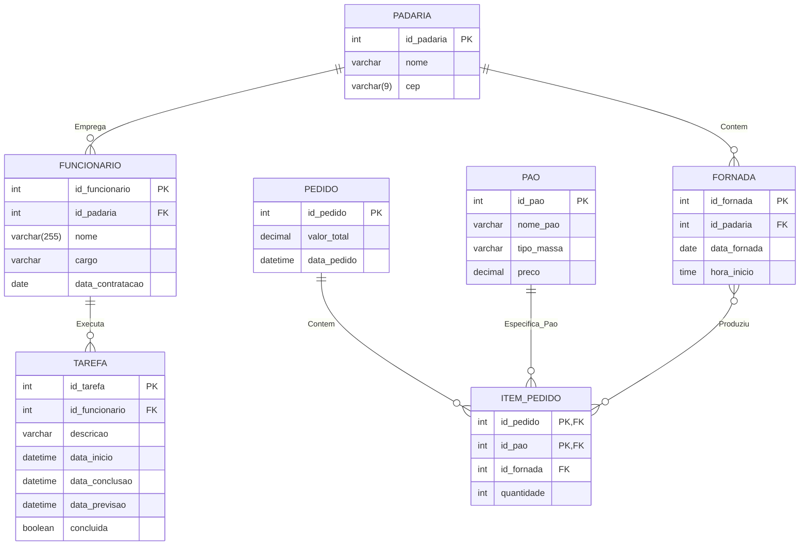

```mermaid
erDiagram
    %% Definição das Entidades (Tabelas) com Atributos
    
    PADARIA {
        int id_padaria PK
        varchar nome
        varchar(9) cep
    }
    
    FUNCIONARIO {
        int id_funcionario PK
        int id_padaria FK
        varchar(255) nome
        varchar cargo
        date data_contratacao
    }
    
    FORNADA {
        int id_fornada PK
        int id_padaria FK
        date data_fornada
        time hora_inicio
    }
    
    PAO {
        int id_pao PK
        varchar nome_pao
        varchar tipo_massa
        decimal preco
    }
    
    TAREFA {
        int id_tarefa PK
        int id_funcionario FK
        varchar descricao
        datetime data_inicio
        datetime data_conclusao
        datetime data_previsao
        boolean concluida
    }

    PEDIDO {
        int id_pedido PK
        decimal valor_total
        datetime data_pedido
    }

    ITEM_PEDIDO {
        int id_pedido PK, FK
        int id_pao PK, FK
        int id_fornada FK 
        int quantidade
    }

    %% Definição dos Relacionamentos
    
    PADARIA ||--o{ FUNCIONARIO : Emprega
    PADARIA ||--o{ FORNADA : Contem

    FUNCIONARIO ||--o{ TAREFA : Executa
    
    %% Relacionamentos resolvidos pela tabela ITEM_PEDIDO
    PEDIDO ||--o{ ITEM_PEDIDO : Contem
    PAO ||--o{ ITEM_PEDIDO : Especifica_Pao
    
    %% Associação de ITEM_PEDIDO com FORNADA (Para rastrear a origem do produto)
    FORNADA }o--o{ ITEM_PEDIDO : Produziu
```
