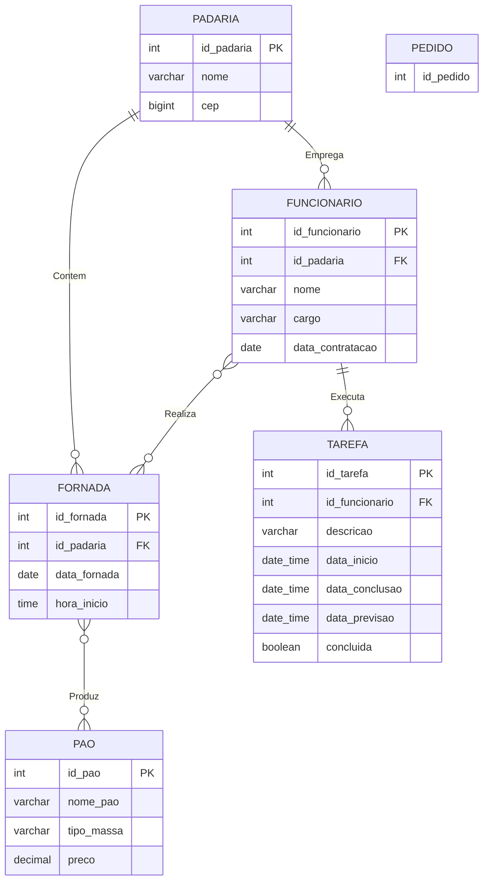

# DesenvolvimentoSoftwareCorp

## Padaria PãoKetin

```mermaid
erDiagram
    %% Definição das Entidades (Tabelas) com Atributos
    
    PADARIA {
        int id_padaria PK
        varchar nome
        bigint cep
    }
    
    FUNCIONARIO {
        int id_funcionario PK
        int id_padaria FK
        varchar nome
        varchar cargo
        date data_contratacao
    }
    
    FORNADA {
        int id_fornada PK
        int id_padaria FK
        date data_fornada
        time hora_inicio
    }
    
    PAO {
        int id_pao PK
        varchar nome_pao
        varchar tipo_massa
        decimal preco
    }
    
    TAREFA {
        int id_tarefa PK
        int id_funcionario FK
        varchar descricao
        date_time data_inicio
        date_time data_conclusao
        date_time data_previsao
        boolean concluida
    }

    PEDIDO {
        int id_pedido
        
    }
    

    %% Definição dos Relacionamentos
    
    PADARIA ||--o{ FUNCIONARIO : Emprega
    PADARIA ||--o{ FORNADA : Contem

    FUNCIONARIO ||--o{ TAREFA : Executa

    %% N:N (FORNADA x PÃO) - Uma tabela associativa seria a implementação real
    FORNADA }o--o{ PAO : Produz

    %% N:N (FUNCIONARIO x FORNADA) - Uma tabela associativa seria a implementação real
    FUNCIONARIO }o--o{ FORNADA : Realiza
    
    %% Onde:
    %% PK = Primary Key (Chave Primária)
    %% FK = Foreign Key (Chave Estrangeira)
    %% O uso de FK nos atributos conecta logicamente as tabelas.
```
